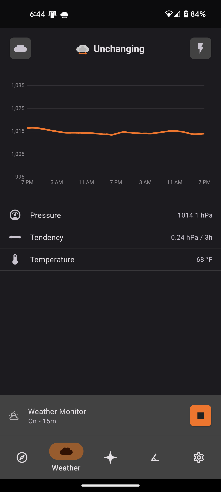
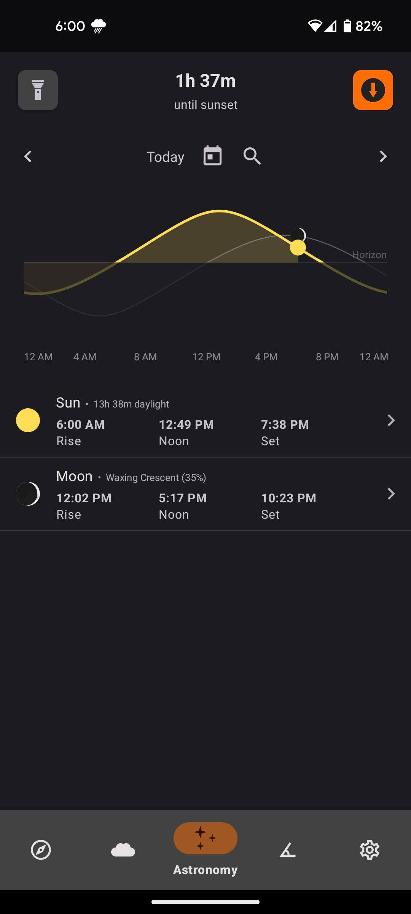

# Trail Sense

> Use your Android phone's sensors to assist with wilderness treks or survival situations. Designed for entirely offline use.

As featured in the [#WeArePlay](http://g.co/play/weareplay-usa) campaign!

<table>
    <tr>
        <th>F-Droid</th>
        <th>Google Play</th>
    </tr>
    <tr>
        <td>
            
        </td>
        <td>
            
        </td>
    </tr>
</table>

## Table of Contents

- [Feature Roadmap](#feature-roadmap)
- [Goals](#goals)
- [Features](#features)
- [Privacy](#privacy)
- [Contributing](#contributing)
- [FAQ](#faq)
- [Support](#support)
- [Open Source Credits](#open-source-credits)
- [License](#license)

## Feature Roadmap
- [x] Q4 2022: Cloud scanner
- [x] Q1 2023: Improved weather forecasts
- [ ] Q2 2023: Maps
- [ ] Q3 2023: Path navigation

## Goals
- Trail Sense must not use the Internet in any way, as I want the entire app usable when there is no Internet connection
- Features must provide some benefits to people using the app while hiking, in a survival situation, etc.
- Features should make use of the sensors on a phone rather than relying on stored information such as guides
- Features must be based on peer-reviewed science or be verified against real world data
- [Use Cases](https://github.com/kylecorry31/Trail-Sense/wiki/Use-Cases)

## Features

- Compass navigation
- Flashlight and SOS
- Barometer forecasting
- Astronomy

See the need for a new feature? [Post it here!](https://github.com/kylecorry31/Trail-Sense/issues/59)

### Navigation

Trail Sense's compass helps you determine the direction of North and navigate to saved locations, known as beacons. In addition to navigating to beacons, you can also use the Backtrack feature to record waypoints and retrace your steps. This tool makes it easy to navigate and find your way in the great outdoors.

Example beacons: home, work, trailhead, campsite

### Weather

Trail Sense helps you stay informed about the weather, while completely offline. You can use it to predict if what the weather will be or be notified if a storm is likely to occur. It also displays the historical daily temperatures for your location, so you can be better prepared. This feature is only available on phones that have a barometer.

### Astronomy

View reliable and accurate sunrise and sunset times for your location. In addition, you can stay informed about the phases of the moon, lunar eclipses, and meteor showers. These tools can help you plan your outdoor activities and ensure you have the necessary light for your endeavors.

# Privacy

Location information gathered by this application does not leave your device (as a matter of fact, this app doesn't use the Internet at all). The altitude and pressure history for the last 48 hours is stored in local app storage - this is used to determine weather forecasts. The last known location is also stored in app preferences to allow faster load times and support app functionality when the GPS can not be reached. The beacons and paths store their location information in a local SQLite database. All of this information is cleared when you clear the app storage or delete it.

## Permissions

- Location (fine, background): Used for beacon navigation, True North, barometer altitude correction (in background), and sun/moon rise/set times

# Debug features
Only available on debug APKs / builds via Android Studio
- Weather tool's barometer chart shows unsmoothed readings in background
- Weather history, elevation history, and path elevations are logged to the files/debug folder in Trail Sense data as CSV files

# Contributing

- [Request a new feature](https://github.com/kylecorry31/Trail-Sense/issues/59)
- [Submit an issue](https://github.com/kylecorry31/Trail-Sense/issues)
- [Translate Trail Sense on Weblate](https://hosted.weblate.org/projects/trail-sense/trail-sense-android)
- [Test out new features](https://github.com/kylecorry31/Trail-Sense/issues/74)

If you choose to write a new feature yourself, send me a message to verify that it is something that I will accept into Trail Sense before your write it (if not, you can always fork this repo and create your own version of Trail Sense!). I will conduct a code review on incoming pull requests to verify they align nicely with the rest of the code base and the feature works as intended.

Issues marked with the help-wanted label are open for community contribution at any time (just submit a PR to main and I will review it), or leave a comment on the story to say you are working on it / ask for more details. Please leave a comment on any other issue before you work on them because they might not have all the details, I may not want it implemented yet, or I may have to implement it myself - for fun :)

If an issue has a milestone and you would like to work on it, please leave a comment before working on it or creating a pull request. If you do not have the feature completed within 4 days of when I plan to release, I will implement it.

If you submit an issue, please be civil and constructive - I will consider all feedback, and if I choose not to implement your suggestion I will post my reasoning. If you are experiencing an issue, please include all relevant details to help me understand and reproduce the issue. If you disagree with a change, please describe why you disagree and how I can improve it (if applicable, please provide research / evidence so I can cross verify).

# FAQ
The FAQ has moved [to the wiki](https://github.com/kylecorry31/Trail-Sense/wiki/Frequently-Asked-Questions-(FAQ))

# Support

<table>
    <tr>
        <th>Buy Me a Coffee</th>
        <th>Liberapay</th>
        <th>Stripe</th>
    </tr>
    <tr>
        <td id="Donate">
         <a href="https://www.buymeacoffee.com/kylecorry">
          Buy Me a Coffee
         </a>
        </td>
        <td>
            
        </td>
        <td>
            <a href="https://buy.stripe.com/28ocQ75ua2EO5EY000">
                Stripe
            </a>
        </td>
    </tr>
</table>

# Open Source Credits

- Icons: [Austin Andrews](https://materialdesignicons.com/contributor/Austin-Andrews) and [Michael Irigoyen](https://materialdesignicons.com/contributor/Michael-Irigoyen)
- Thank you to everyone who tried out this app and opened issues, suggested features, provided translations, or tested debug builds for me
- Thanks to @qwerty287 and @Portagoras for implementing several features and bugfixes

# License

- **[MIT license](LICENSE)**
