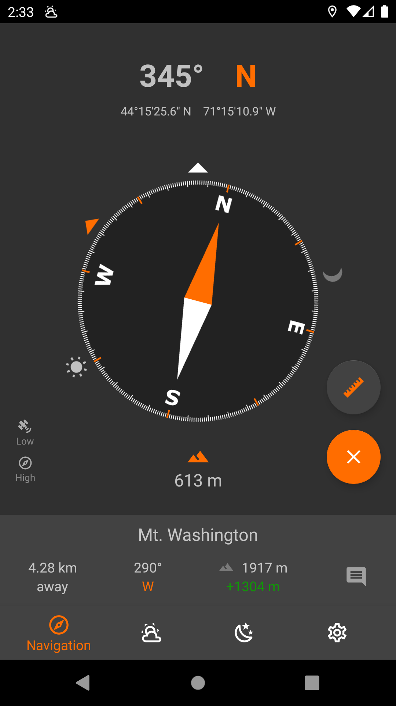
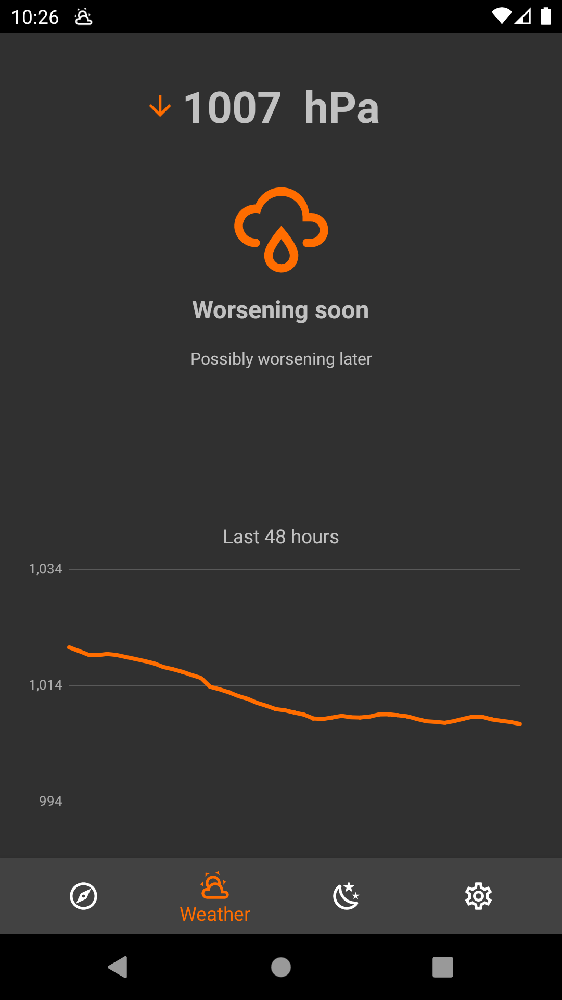
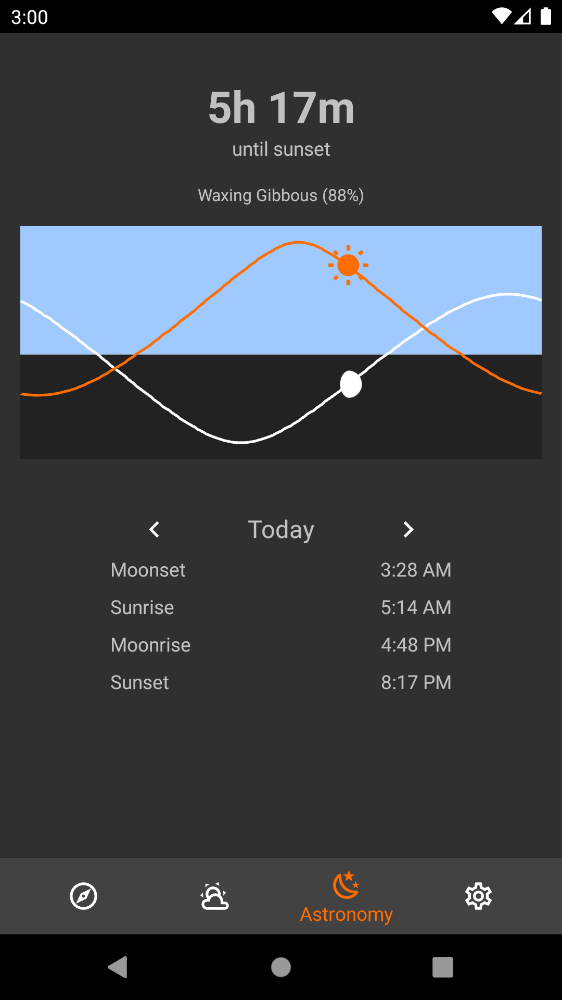

# Trail Sense

<table>
    <tr>
        <th>F-Droid</th>
        <th>Google Play</th>
        <th>Donate</th>
    </tr>
    <tr>
        <td>
            
        </td>
        <td>
            
        </td>
        <td id="Donate">
         
        </td>
    </tr>
</table>

 An Android app which provides useful information about the environment and can be used offline (designed for hiking / mountaineering).

## Features
* Compass
* Barometer
* Astronomy

## Navigation
The compass can be used to determine the direction to North, and when combined with the GPS it can be used to navigate to predefined locations. The predefined locations, known as beacons, can be created while at a location and at any point you can use the compass to navigate back to where the beacon was placed.

Example beacons: home, work, trailhead, campsite

## Weather
The barometer can be used to determine if the weather will change soon and if a storm is likely to occur. The barometric pressure history (last 48 hours) is displayed as a graph and an interpretation of the current reading is shown. If the pressure suddenly drops, a storm alert notification is sent.

## Astronomy
View the sun/moon rise and set times and see the current phase of the moon at your exact location.

# Privacy
Location information gathered by this application does not leave your device (as a matter of fact, this app doesn't use the Internet at all). The altitude and pressure history for the last 48 hours is stored in local app storage - this is used to determine weather forecasts. The last known location is also stored in app preferences to allow faster load times and support app functionality when the GPS can not be reached. The beacons store their location in a local SQLite database. All of this information is cleared when you clear the app storage or delete it.

## Permissions
- Location (fine, background): Used for beacon navigation, True North, barometer altitude correction (in background), and sun/moon rise/set times 

# Credits
- Weather icons: [Austin Andrews](https://materialdesignicons.com/contributor/Austin-Andrews)
- Moon icons: [Michael Irigoyen](https://materialdesignicons.com/contributor/Michael-Irigoyen)
- Charts: [MpAndroidChart](https://github.com/PhilJay/MPAndroidChart)
- Thank you to everyone who tried out this app and opened issues, suggested features, or even tested debug builds for me

