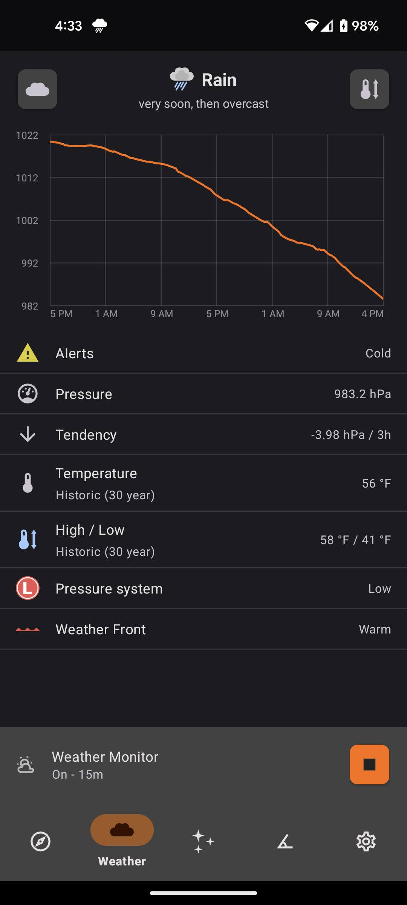
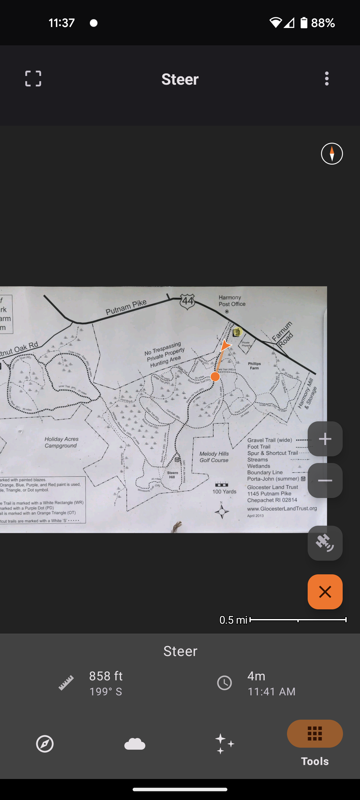
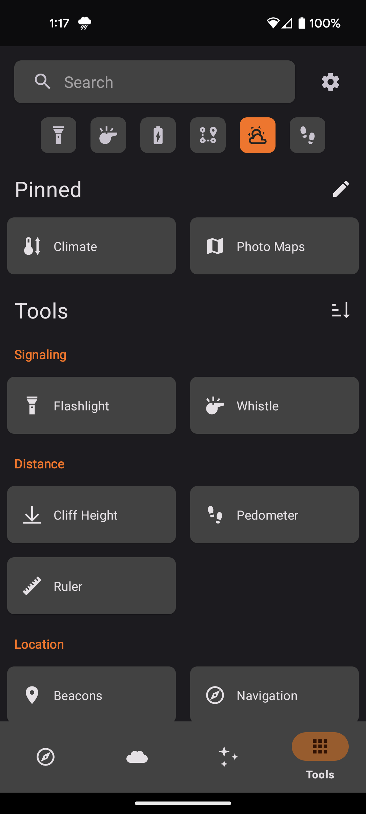

# Trail Sense

> Use your Android phone's sensors to assist with wilderness treks or survival situations. Designed for entirely offline use.

Trail Sense is a tool, and just like any other tool that you bring into the wilderness, it's essential to have backup equipment and skills.

As featured in the [#WeArePlay](http://g.co/play/weareplay-usa) campaign!

See the [Technical Blog / Research](https://kylecorry.com/research/categories/trail-sense/)

<table>
    <tr>
        <th>F-Droid</th>
        <th>Google Play</th>
    </tr>
    <tr>
        <td>
            
        </td>
        <td>
            
        </td>
    </tr>
</table>

## Table of Contents

- [Feature Roadmap](#feature-roadmap)
- [Goals](#goals)
- [Features](#features)
- [Privacy](#privacy)
- [Contributing](#contributing)
- [FAQ](#faq)
- [Support](#support)
- [Open Source Credits](#open-source-credits)
- [License](#license)

## Feature Roadmap
In 2025, the main focus will be:
- Photo Maps (improvements)
- Survival Guide (improvements)
- Cell Signal Finder (new)
- Add official support for foraging, fishing, and hunting

### Priorities
Issue priority is denoted by labels on issues.
- **p1**: Critical priority, requires a hotfix in most cases.
- **p2**: High priority, at least one is likely to be included in each release during the year. These are typically the goals for the year.
- **p3**: Moderate priority, may be included in a couple releases during the year. These will get promoted to p2 as features are completed.
- **p4**: Low priority, I may not have time to implement these or are likely years away. Many are open for community contribution.

## Goals
- Trail Sense must not use the Internet in any way, as I want the entire app usable when there is no Internet connection
- Features must provide some benefits to people using the app while hiking, in a survival situation, etc.
- Features should make use of the sensors on a phone rather than relying on stored information such as guides
- Features must be based on peer-reviewed science or be verified against real world data
- [Use Cases](https://github.com/kylecorry31/Trail-Sense/wiki/Use-Cases)

## Features

- Designed for hiking, backpacking, camping, and geocaching
- Place beacons and navigate to them
- Follow paths
- Retrace your steps with backtrack
- Use a photo as a map
- Plan what to pack
- Be alerted before the sun sets
- Predict the weather
- Use your phone as a flashlight
- [And much more!](https://github.com/kylecorry31/Trail-Sense/wiki/Use-Cases)

See the need for a new feature? [Post it here!](https://github.com/kylecorry31/Trail-Sense/issues/2590)

For a list of community contributed device feature support, [go here](https://kylecorry.com/Trail-Sense/devices.html)

<table>
  <tr>
    <td>
      
    </td>
    <td>
      
    </td>
    <td>
      
    </td>
  </tr>
  <tr>
    <td>
      
    </td>
    <td>
      
    </td>
    <td>
      
    </td>
  </tr>
</table>

# Privacy

Location information gathered by this application does not leave your device (as a matter of fact, this app doesn't use the Internet at all). The altitude and pressure history for the last 48 hours is stored in local app storage - this is used to determine weather forecasts. The last known location is also stored in app preferences to allow faster load times and support app functionality when the GPS can not be reached. The beacons and paths store their location information in a local SQLite database. All of this information is cleared when you clear the app storage or delete it.

## Permissions
### Sensitive
- **POST_NOTIFICATIONS**
  - Allows Trail Sense to display notifications (backtrack, weather, sunset alerts, astronomy events, water boil timer, etc)
  - **When denied**: Alerts will not be displayed and some services may not function properly depending on your device manufacturer.
- **ACCESS_FINE_LOCATION / ACCESS_COARSE_LOCATION**
  - Allows Trail Sense to retrieve your location for navigation, weather (sea level calibration), and astronomy. 
  - **When denied**: You will have the ability to mock your location under Settings > Sensors > GPS. On Android 14+, backtrack and weather will be unavailable due to Android OS constraints.
- **ACCESS_BACKGROUND_LOCATION**
  - Allows Trail Sense to retrieve your location for sunset alerts while in the background. On some devices, this will also improve the reliability of backtrack and weather monitor (though shouldn't be needed on most devices).
  - **When denied**: If you travel and do not open Trail Sense, but have Sunset and Sunrise Alerts enabled, the times will likely be inaccurate.
- **ACTIVITY_RECOGNITION**
  - Allows Trail Sense to use your phone's pedometer for distance calculation.
  - **When denied**: The pedometer will not work.
- **CAMERA**
  - Allows Trail Sense to use your camera on the sighting compass, clinometer, and for taking photos used by the Cloud Scanner, QR Code Scanner, and Photo Maps.
  - **When denied**: You will not be able to use the sighting compass, camera clinometer, or QR Code Scanner. You will need to pick an existing photo to use for the Cloud Scanner or Photo Maps.
- **SCHEDULE_EXACT_ALARM**
  - Allows Trail Sense to post a notification at an exact time. This is used by the Clock tool (when updating system time) and Sunset and Sunrise Alerts.
  - **When denied**: The clock and sunset alerts may not be accurate (can be off by several minutes).
 
### Not sensitive (always granted)
- **RECEIVE_BOOT_COMPLETED**
  - Allows Trail Sense to restart when you reboot your device. This will re-enable backtrack, weather monitor, and several other background services.
- **FOREGROUND_SERVICE**
  - Allows Trail Sense to start foreground services, such as backtrack and weather monitor.
- **FLASHLIGHT**
  - Allows Trail Sense to control the phone's flashlight.
- **VIBRATE**
  - Allows Trail Sense to vibrate the phone. Used for haptic feedback on dials and on the metal detector tool.
- **WAKE_LOCK**
  - Allows Trail Sense to reliably run services such as backtrack and weather monitor, especially when the frequency is under 15 minutes.

# Debug features
Only available on debug APKs / builds via Android Studio
- Weather tool's barometer chart shows unsmoothed readings in background
- Weather history, elevation history, path elevations, and latest cloud scan are logged to the files/debug folder in Trail Sense data as CSV files
- Weather settings shows statistics timing (for weather monitor service)
- Paths show statistics about timing (for backtrack service)

# Contributing
See the [CONTRIBUTING.md](https://github.com/kylecorry31/Trail-Sense/blob/main/CONTRIBUTING.md) file for details on contributing to Trail Sense.

# Copying
You are allowed to create copies of Trail Sense and rebrand to what you see fit. It is under the MIT license. 

Please change the following if you are using this as the base for you app:
- App name
- Package name
- Support email
- App icon (optional)

# FAQ
The FAQ has moved [to the wiki](https://github.com/kylecorry31/Trail-Sense/wiki/Frequently-Asked-Questions-(FAQ))

# Support

The best way to support Trail Sense is to send me your feedback, share how you are using it, test nightly builds, or post your ideas for new features.

# Open Source Credits

- Thank you to everyone who tried out this app and opened issues, suggested features, provided translations, or tested debug builds for me
- Please see the in app licenses for all open source licenses
- Contributors and translators: https://github.com/kylecorry31/Trail-Sense/graphs/contributors
- [showdownjs](https://github.com/showdownjs/showdown): used for website markdown rendering [License](https://github.com/showdownjs/showdown/blob/master/LICENSE)

# License

- **[MIT license](LICENSE)**
