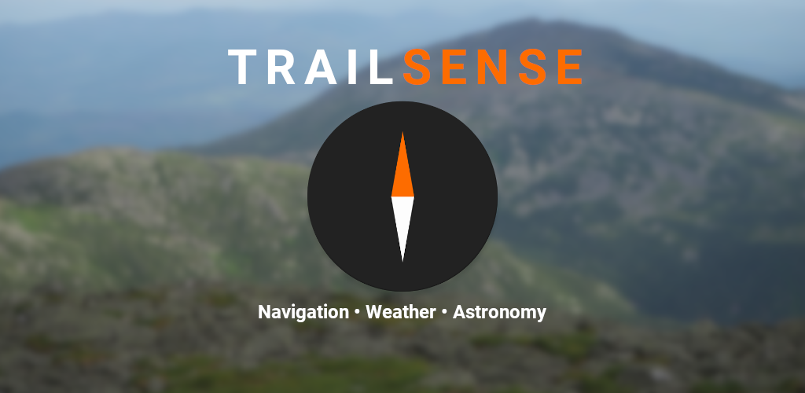

# Trail Sense

> Use your Android phone's sensors to assist with wilderness treks or survival situations. Designed for entirely offline use.

<table>
    <tr>
        <th>F-Droid</th>
        <th>Google Play</th>
    </tr>
    <tr>
        <td>
            
        </td>
        <td>
            
        </td>
    </tr>
</table>

## Table of Contents

- [Features](#features)
- [Privacy](#privacy)
- [Contributing](#contributing)
- [FAQ](#faq)
- [Support](#support)
- [Open Source Credits](#open-source-credits)
- [License](#license)

## Features

- Compass navigation
- Flashlight and SOS
- Barometer forecasting
- Astronomy

See the need for a new feature? [Post it here!](https://github.com/kylecorry31/Trail-Sense/issues/59)

### Navigation

The compass can be used to determine the direction to North, and when combined with the GPS it can be used to navigate to predefined locations. The predefined locations, known as beacons, can be created while at a location and at any point you can use the compass to navigate back to where the beacon was placed.

Example beacons: home, work, trailhead, campsite

### Weather

The barometer can be used to determine if the weather will change soon and if a storm is likely to occur. The barometric pressure history (last 48 hours) is displayed as a graph and an interpretation of the current reading is shown. If the pressure suddenly drops, a storm alert notification is sent. Note, this feature is only available for phones which have a barometer.

### Astronomy

View the sun/moon rise and set times and see the current phase of the moon at your exact location.

# Privacy

Location information gathered by this application does not leave your device (as a matter of fact, this app doesn't use the Internet at all). The altitude and pressure history for the last 48 hours is stored in local app storage - this is used to determine weather forecasts. The last known location is also stored in app preferences to allow faster load times and support app functionality when the GPS can not be reached. The beacons store their location in a local SQLite database. All of this information is cleared when you clear the app storage or delete it.

## Permissions

- Location (fine, background): Used for beacon navigation, True North, barometer altitude correction (in background), and sun/moon rise/set times

# Contributing

- [Request a new feature](https://github.com/kylecorry31/Trail-Sense/issues/59)
- [Submit an issue](https://github.com/kylecorry31/Trail-Sense/issues)
- [Translate Trail Sense on Weblate](https://hosted.weblate.org/projects/trail-sense/trail-sense-android)
- [Provide feedback on the weather forecasting](https://github.com/kylecorry31/Trail-Sense/issues/71)
- [Test out new features](https://github.com/kylecorry31/Trail-Sense/issues/74)

If you choose to write a new feature yourself, send me a message to verify that it is something that I will accept into Trail Sense before your write it (if not, you can always fork this repo and create your own version of Trail Sense!). I will conduct a code review on incoming pull requests to verify they align nicely with the rest of the code base and the feature works as intended.

# FAQ

- **Will there be an iOS version?**
  - No - unfortunately I don't have a Mac or iPhone, and wouldn't be able to develop and test an iOS version (at least, there won't be an iOS version from me)
- **Can I request a new feature?**
  - Of course! See the [Contributing section](#contributing) for more details - I will consider every feature request, and it will be more likely that your feature gets included if you provide some rational behind how it could benefit TS users in wilderness treks or survival situations. Even if your feature idea is beneficial to only a small percent of users, I may still include it (even if it is in an experimental tab, or unlockable through settings)
- **When can I expect new releases?**
  - I will try to create a release every week or two with new features or bug fixes. Some features may be feature flagged (via a hidden setting) to deliver thouroughly tested features. Debug builds are updated as features are completed. I can't gaurantee this will always be the case, work/life may get in the way.
- **The pressure graph isn't populating or is very jagged, how can I fix it?**
    - You may need to mark Trail Sense as exempt from battery optimizations: [how to make TS exempt](https://dontkillmyapp.com/)
- **The compass was working, but now it will not move and I haven't touched any settings. How can I fix it?**
    - Sometimes Android stops reporting compass data to apps, and you may need to reboot your device to fix the issue.
- **What other apps would be useful in a survival situation?**
    - [Offline Survival Manual](https://github.com/ligi/SurvivalManual)
        - A survival guide application. This app will teach you how to use resources around you to survive in almost every environment.
    - [OsmAnd~](https://github.com/osmandapp/OsmAnd)
        - An offline maps application. Prior to going on a hike, download the maps you need. This app is free via F-Droid.
    
# Support

<table>
    <tr>
        <th>PayPal</th>
        <th>Liberapay</th>
    </tr>
    <tr>
        <td id="Donate">
         
        </td>
        <td>
            
        </td>
    </tr>
</table>

# Open Source Credits

- Icons: [Austin Andrews](https://materialdesignicons.com/contributor/Austin-Andrews) and [Michael Irigoyen](https://materialdesignicons.com/contributor/Michael-Irigoyen)
- Charts: [MpAndroidChart](https://github.com/PhilJay/MPAndroidChart)
- Thank you to everyone who tried out this app and opened issues, suggested features, provided translations, or tested debug builds for me

# License

- **[MIT license](LICENSE)**
