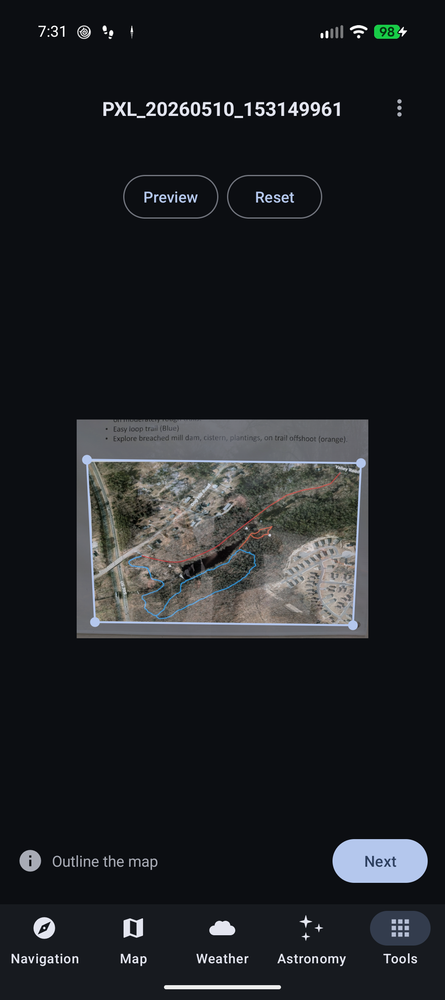
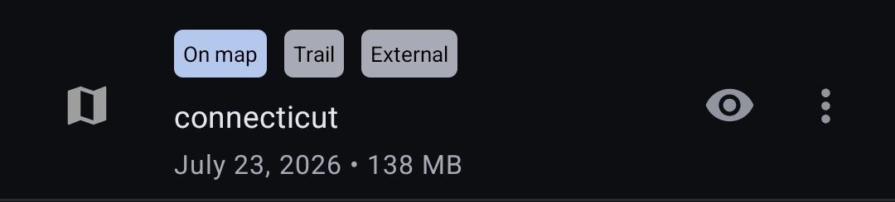
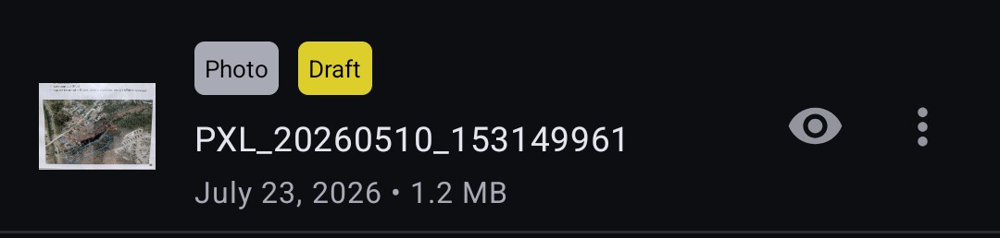
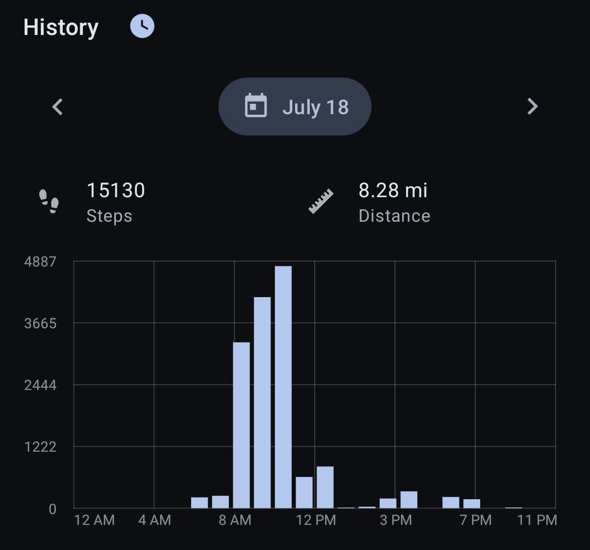
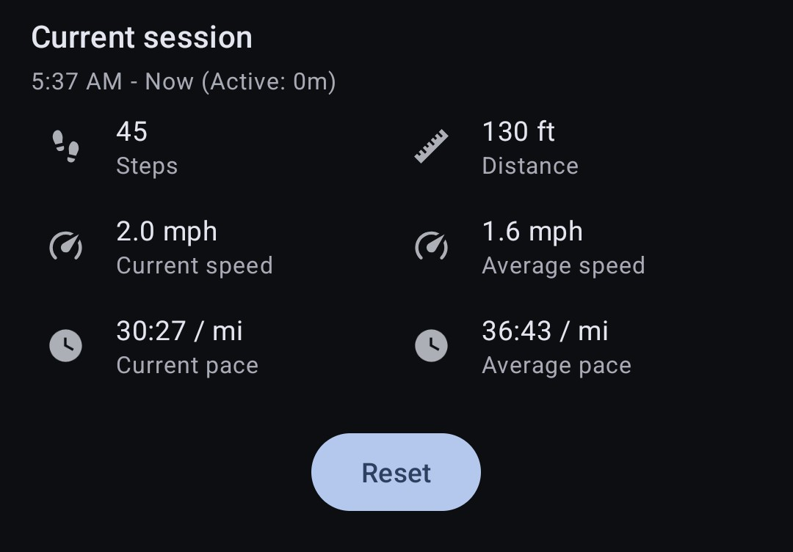
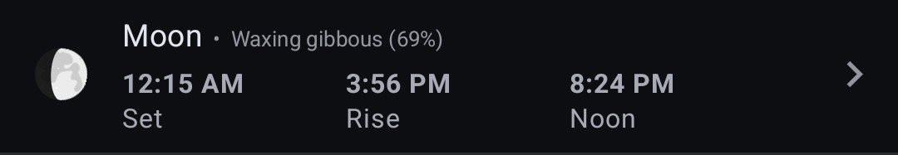
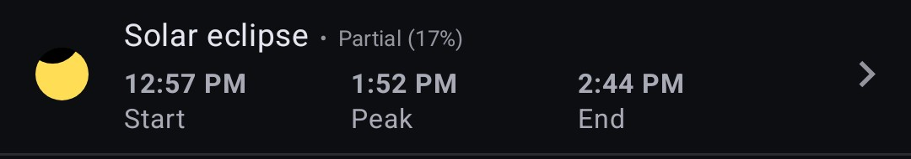
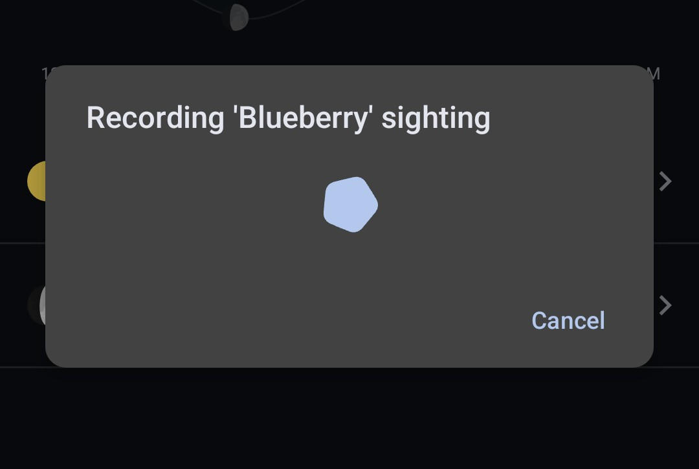
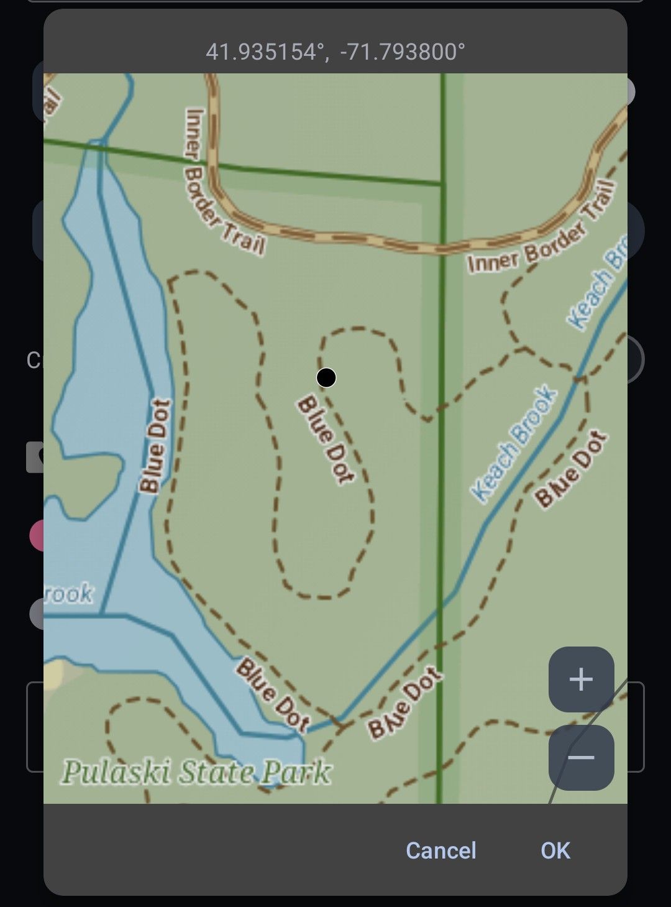
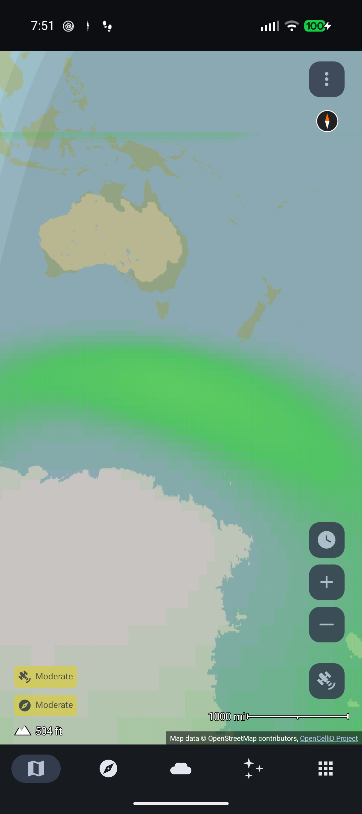

# 8.1.0 Release Notes

This contains a list of the changes in Trail Sense 8.1.0.

## Offline Maps

### Automatic Corner Detection
When you import a new uncalibrated photo map, Trail Sense will now automatically attempt to detect the corners of the map to avoid the need for manual corner selection. If you don't like what it detects, you can reset the corners and select them manually.

    

### External Trail Map Files
You can now choose to have Trail Sense reference external `.map` files rather than copying them to the app's internal storage. This is useful if you want to keep your maps in a shared location or on an SD card. This option can be enabled in Offline Maps settings (disable 'Copy maps to Trail Sense'). Maps that are external are marked with an 'External' tag and there's a menu option to copy them to internal storage.

### Draft Map Indicator
Maps that are not yet usable for navigation are marked with a 'Draft' tag. This will appear on photo maps which have not yet been calibrated, and on trail maps which have a missing or invalid file.

### Minor Changes
- Sidewalk styling in trail maps was changed to make them distinct from trails.
- Trail maps are validated before import to ensure they are not corrupted. If a trail map is invalid, it will not be imported and an error message will be shown.

## Pedometer

### History
The pedometer tool now keeps a history of your sessions. The history includes the session start and end times, the distance traveled, the number of steps taken, the average speed, the time spent moving, and a breakdown of steps by hour.

The hourly step chart shows the number of steps taken in each hour of the day. You can tap on a bar in the chart to view the distance traveled and steps taken during that hour. The date picker can be used to view the history for a different day. It merges all sessions for the day into a single chart.

You can click the clock button next to the 'History' section to view your sessions.

History is kept for 30 days by default, but this can be changed in pedometer settings ('Step history'). You can also delete individual sessions from the session history list.

    

### Average Pace Time
You can now choose whether the average pace/speed calculations are based on the active time (time spent moving) or the elapsed time (including breaks). This can be changed in pedometer settings ('Average pace time'). It defaults to active time, which is a more accurate representation of your pace while hiking.

### Pace
Your pace (current and average) is now displayed in time per kilometer or mile, depending on your distance units. A lower pace means you are moving faster. For example, a pace of 12:30 / km means it takes 12 minutes and 30 seconds to travel one kilometer.

    

### Active Duration
The pedometer now tracks the time spent moving (active duration) in addition to the elapsed time of the session. The active duration is shown in parentheses next to the session time for the current session. This can help you figure out how long you spent moving versus resting during a hike.

### Minor Changes
- The daily reset option is enabled by default for new users. Existing users will not see a change in behavior unless they change the setting.

## Astronomy

### Moon Phase Icons
The moon phase icons have been updated to reflect the real-time moon phase rather than selecting from a set of static icons. In addition, the phase overlay is now rotated to reflect the actual orientation of the bright limb of the moon in the sky, so it should line up with what you see when you look at the moon.

### Eclipse Icons
The solar and lunar eclipse icons have been updated to reflect what you would see during the peak of the eclipse, so you can better decide if it is worth viewing.

### Minor Changes
- There's a cancel button on the search now, in case it is taking too long to find the next astronomical event.

## Field Guide

### Record Sighting Quick Action
A new quick action has been added to the Field Guide tool to allow you to quickly record a sighting. When you tap the quick action, it will open a sheet for you to select the page to record the sighting on and will automatically create a new sighting with your current location and time. This works similarly to the 'Create Beacon' quick action.

    

## Survival Guide
The Survival Guide content has been updated to reflect the latest information and best practices. A new 'References' section was added that lists out some of the sources that were referenced when writing and checking the content.

## Miscellaneous

### Material 3 Expressive
Trail Sense uses Material 3 Expressive in more places now so it should better match with other apps on your device. This includes the non-dynamic theme which retains the orange as the primary color but should look a bit more like the Material 3 Expressive theme.

### Location Selection from Map
When entering a location, clicking the fill from sources button (the button on the left of the text input) will now show an option to select the location from a map. This will open a map view with all layers you use in the Map tool, and you can tap on the map to select a location.

    

### Plugins
Plugins can be enabled via experimental settings and support was added for loading map layers from plugins. The 'Settings' and 'Map Layers' user guides contain more details about using plugins. Plugins are contributed by the community and there aren't any known plugins at this point. I have NWS weather and aurora plugins on my GitHub, but you have to build from source right now. Developers interested in creating their own plugins should check out the plugin documentation in the source code.

This feature is currently disabled on Google Play. I'm not sure if I will enable it since I'm concerned about future Play Store policies and headaches during the release review process.

    

### Minor Changes
- Long pressing the arrows on the date picker will now repeat the action, so you can quickly scroll through dates.
- Translation updates. Thank you to all the translators!

## Bug Fixes
- Fixed a bug where the alarms ('Use alarm...' settings for some of the alerts) would not sound on Android 17.
- Fixed a bug where the Wi-Fi and Bluetooth status in the Battery tool would show as 'Off' when they were actually on when the device was in airplane mode. Thanks to @Maqbool61 for fixing this!
- Fixed a bug where the camera would remain running in the Magnifier tool while the viewfinder was frozen.
- Improved GPS cache behavior to avoid mixing old and new data and improve when to accept a new reading.
- Added a compatibility workaround for Oppo devices which had missing icons in widgets. Available as the 'Widget icon compatibility mode' setting in experimental settings.
- Removed the background location request dialog from the Turn Back tool.
- Improved the performance of map layer rendering.
